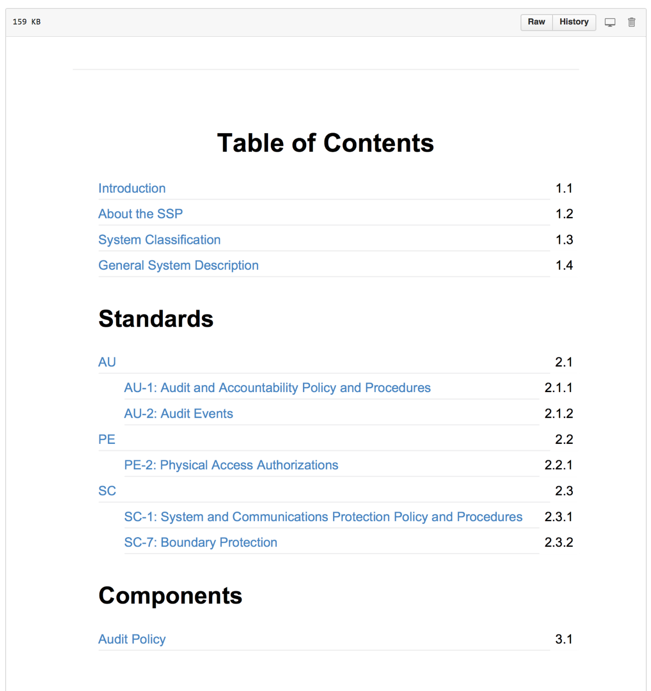
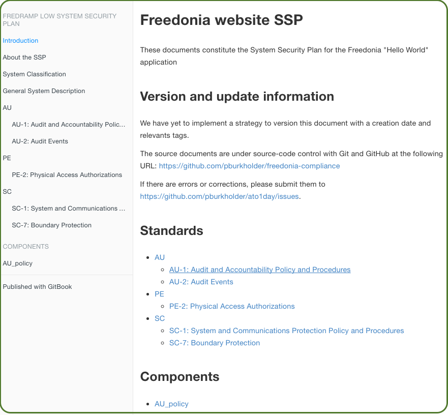
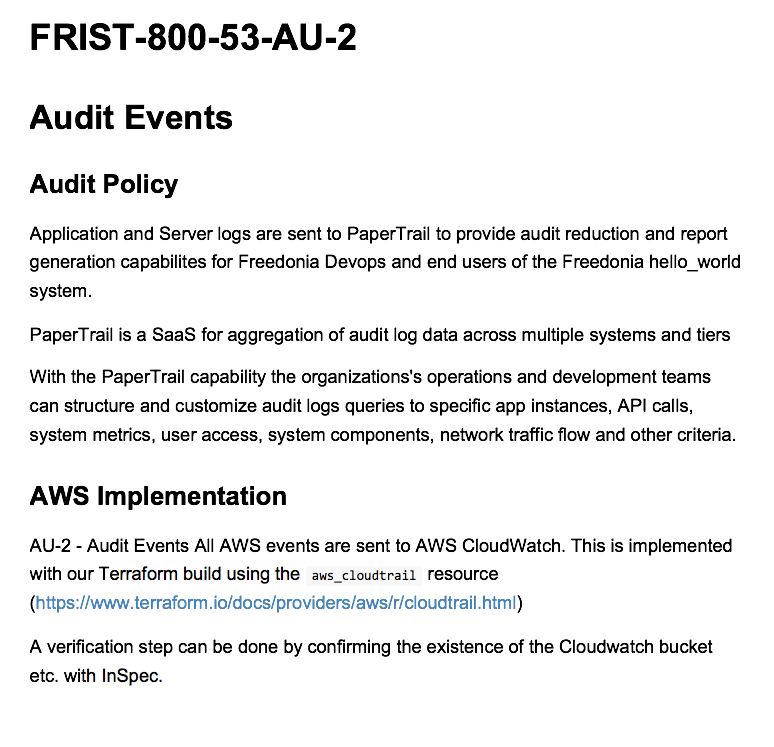

Welcome to Freedonia Compliance: Beginner Exercise for OpenControl
===================================================================

This project repository demonstrates a simple `System Security Plan` generated using the [OpenControl](http://opencontrol.xyz) framework to automate security compliance paperwork.

We created this demonstration because wanted a simple starter example for ourselves and others. We found the existing mid-2016 OpenControl documentation and examples from 18F somewhat hard to reason about because of the specificity to their use case for Cloud.gov.

Audience
---------

Anyone trying to get started with [OpenControl](http://opencontrol.xyz) or [Compliance-Masonry](https://github.com/opencontrol/compliance-masonry), including:

* FISMA newbies that don't want to write big word documents
* FISMA experts that need a more efficent way of doing paper work
* FISMA enforcers that need to trust the OpenControl model and tools we're presenting


Scenario
--------

For this exercise, we'll take the role of IT staff for the Republic of Freedonia.

Freedonia thinks America is just awesome! Freedonia has modeled their `FRedRAMP` program for certifying security of major Information Systems after America's `FedRAMP` for program certifying cloud service providers. (If it's good enough for the cloud...)

The starting point for `FRedRAMP` certifications is the `FRIST 800-53`, which is identical to America's `NIST 800-53` except with less security controls. A lot less.

### The Controls

Freedonia's `FRIST 800-53` has only 6 security controls:

| ID         | Title          | Type |
| ---------- | -------------- | --------| 
| AU-1 | AUDIT AND ACCOUNTABILITY POLICY AND PROCEDURES | organizational control on audit policy |
| AU-2 | AUDIT EVENTS | technical control at the node level | 
| PE-2 | PHYSICAL ACCESS AUTHORIZATIONS | organization control on who accesses data center |
| SC-1 | SYSTEM AND COMMUNICATIONS PROTECTION POLICY AND PROCEDURES | organizational control on how components communicate securely |
| SC-7 | BOUNDARY PROTECTION | technical control defending boundary of entire system |
| XX-1 | MOCK/DUMMY CONTROL | here to demonstrate that a control in standard does not have to referenced in a certification |

### The Certification

The certification of `FRedRAMP-Low` requires all the above controls except for XX-1. 

The standards and certifications are housed in a repository for easier re-use at [https://github.com/pburkholder/freedonia-frist](https://github.com/pburkholder/freedonia-frist).

### The Information System

The system we're building is a 'Hello World' website for Freedonia, which will comprise:

* Two Amazon Web Service Virtual Private Clouds (AWS VPCs),
one each for development and production
* In each AWS VPC, one node with `NGINX` web server and the static content for the website
* Infrastructure for logging traffic

Desired Outcome: A Manged System Security Plan 
------------------------------------------------

To obtain the `Authority to Operate`, or `ATO`, we'll need an `System Security Plan`, or `SSP`.

The typical `SSP` is a 400 page Word Document re-written for each System, even when many of the controls refer to the same components used by many systems. Creating Word Documents manually cannot keep up with our improved DevOps practices and our high velocity Continuous Integration and Delivery pipeline.

So instead, we want to manage our `SSP` using the tooling from OpenControl to manage, generate, and deploy (e.g., publish) our paperwork like we manage, generate, and deploy our applications. 

With the OpenControl tooling, all of our details about system components, standards, and certifications are kept as `YAML` files and versioned as needed.  Using the [Compliance-Masonry](https://github.com/opencontrol/compliance-masonry) SSP-assembler written in GO, we can combine OpenControl `YAML` files from multiple repositories into PDF document or HTML files.

### The System Security Plan as PDF

At the end of this excercise, we can generate a PDF version of our SSP with a single command. It will look like this:

> 

A complete generated PDF is [included here](./assets/example.pdf).

### The System Security Plan as HTML

Alternatively--maybe even preferably--we can also generate our `SSP` as a website that looks like this on the front page:

> 

and like this on a page for particular control:

> 


Requirements to Use OpenControl
--------------------------------
These steps assume you already have:

* a \*nix type operating system
* `Go` installed
* `Compliance-Masonry` v 1.1.1 installed per notes at https://github.com/opencontrol/compliance-masonry
* `calibre` installed for PDF generation
	* For OS X with Homebrew installed, try `brew cask install calibre`
* `node-js` installed for local viewing at https://localhost:4000 OR

NOTE: The 1.1.1 release of `compliance-masonry` requires at least one-component to run


Minimal File Structure for an OpenControl-based SSP
----------------------------------------------------

The minimum initial files and file tree structure we need to generate a standalone `SSP` is:

```
.
├── README.md   # the file you're reading now
├── AU_policy
│   └── component.yaml        # a local description of the Audit policy (AU)
├── certifications
│   └── FredRAMP-low.yaml     # a mapping of which controls from standards/FRIST-800-53 are needed for certification
├── markdowns         
│   ├── README.md             # the introduction to the entire SSP
│   ├── SUMMARY.md            # a table of contents for narrative documents of the SSP
│   └── system_documentation  # directory for narrative documents
│       ├── about-the-ssp.md
│       ├── system-data.md
│       └── system-description.md
├── opencontrol.yaml          # the schema for SSP and its remote resources/dependencies
└── standards
    └── FRIST-800-53.yaml     # the security control standards list by family and name
```

It just so happens you can get these files and file tree structure by cloning this repository!


Building and Updating the SSP Yourself
--------------------------------------

Clone this repo, then `cd` into `freedonia-compliance`.  Then run:

```
compliance-masonry get
compliance-masonry docs gitbook `FredRAMP-low`
```

At this point, you have generated a series of new `YAML` files representing your `SSP` inside of the `export` directory that has artfully combined data from the all other OpenControl `YAML` files.

Our next step is to turn the `YAML` files representing our SSP into something even more human readable.

To make a PDF version at :

```
cd exports && gitbook pdf ./ ./compliance.pdf
# creates the PDF at `exports/compliance.pdf`

```

To make a HTML web site version:

```
cd exports && gitbook serve
# visit your HTML SSP at https://localhost:4000

```

The steps above are included in the project's `Makefile` so you can reliably run, say:

```
make clean pdf
# or
make clean serve
```

Review
-------

We


Feedback
--------

Please open issues at the [ATO1Day
Project](https://github.com/pburkholder/ato1day-compliance/issues), instead of within this repository.
